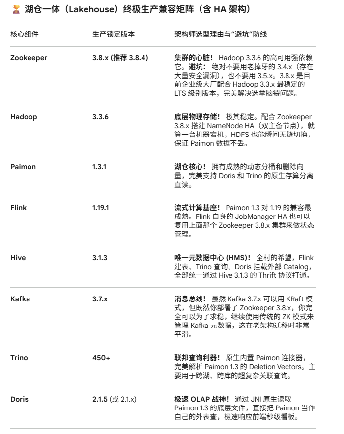

# bigdata
一套企业级金融交易类的流式湖仓一体大数据平台，方案整体具备TB级的数据采集，分析功能，结合即席查询能力，具备日常固定报表的开发等

整体学习环境为VMWare克隆的三台linux服务器，操作系统我centos 7  

落地方案框架推荐 Gemini3 pro
!

实时入湖（Kafka -> Flink -> Paimon）：
交易流水进入 Kafka，Flink 1.19 实时消费，利用 Paimon 1.3 的 bucket = -1 (动态分桶) 和 changelog-producer = lookup 写入底层 HDFS。

统一注册（Paimon -> Hive Metastore）：
Flink 在写入 Paimon 时，将表结构自动同步到 Hive Metastore (HMS 3.1.3)。这是打通全链路的唯一钥匙！

“双剑合璧”的查询层（Trino + Doris）：
内部深度分析用 Trino： 分析师要查 3 年前的冷数据，还要跨库关联 MySQL 里的历史维表，用 Trino 450 直连 HMS 查询 Paimon。

高频实时看板用 Doris： 面向交易员的秒级监控大屏（QPS 可能高达上万）。
在 Doris 里执行一条 CREATE CATALOG paimon_catalog PROPERTIES ("type"="paimon", "hive.metastore.uris"="thrift://hms:9083");，Doris 就能瞬间读取 Paimon 的数据，利用其极速的向量化计算引擎毫秒级出图。

方案设计的AI建议：
风险组件 / 防线,致命阻塞症状 (不可抗力),架构师排雷方案 (核心动作)
1. Flink 依赖冲突(Hadoop Shade 机制),Flink 任务疯狂重启，抛出 NoSuchMethodError (通常是 Guava/Protobuf 打架)；或导致下游引擎 JVM 崩溃。,Flink 的 lib/ 目录下，绝对只保留官方的 flink-shaded-hadoop-3-uber.jar。严禁混入任何原生的 hadoop-common.jar 或第三方未经 Shade（遮蔽）的包。
2. Doris 内存溢出(JNI 外表读取),Doris 挂载 Paimon 外表查询时，BE (Backend) 节点因 Java 堆外内存泄漏 (OOM) 直接宕机脱机。,部署 Doris 时，必须修改 BE 配置文件 be.conf。通过调整 JvmService 的 JAVA_OPTS 参数，强制为 JVM 预留 4GB - 8GB 的内存，专用于 Paimon 底层 Parquet/ORC 文件的解析。
3. Trino 插件报错(类加载器污染),Trino 集群启动失败，或执行 SQL 时报错“找不到 Catalog”，发生严重的类加载器冲突。,Trino 450+ 已经原生内置了 Paimon 连接器。严禁画蛇添足地把 paimon-trino-*.jar 手动丢进 Trino 的 plugin 目录！只需在 etc/catalog/paimon.properties 中写明 connector.name=paimon 即可。

5. step 1 
模拟生成数据，在mysql中模拟规则数据， kafka中模拟交易数据。