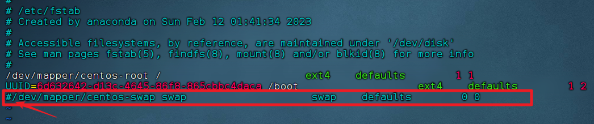

# Apache Doris 2.1.x 集群部署手册

部署目标：1 FE + 3 BE 混合部署

服务器节点：bjc55, bjc56, bjc57

软件版本：apache-doris-2.1.x-bin-x64.tar.gz

角色规划：

    FE (Master): bjc55
    
    BE: bjc55, bjc56, bjc57

一、 环境预检查（Doris 的“生死线”）

***Doris 运行在 Linux 上，如果底层参数没调好，BE 会直接启动失败。请在三台机器上全部执行以下操作：***

1. 修改文件描述符限制

       sudo vim /etc/security/limits.conf

# 在末尾添加

     * soft nofile 65536
     * hard nofile 65536
     * soft nproc 65536
     * hard nproc 65536

2. 修改虚拟内存区域限制(*这是 Doris 运行高并发查询的基础*)

        sudo sysctl -w vm.max_map_count=2000000

# 永久生效
    echo "vm.max_map_count=2000000" | sudo tee -a /etc/sysctl.conf
3. 关闭 Swap（交换分区）*为了保证查询性能，建议关闭 swap：*
   
        sudo swapoff -a

# 并在 /etc/fstab 中注释掉 swap 相关行

    allsync.sh /etc/fstab

# 二、 具体安装步骤
1. 解压与分发
   在 bjc55 上执行：

        tar -zxvf /opt/software/apache-doris-2.1.5-bin-x64.tar.gz -C /opt/module/
        cd /opt/module/
        mv apache-doris-2.1.5-bin-x64 doris
2. 配置 FE (Frontend) - 在 bjc55 操作

            vim doris/fe/conf/fe.conf

Properties

        # 1. 配置文件存储路径（记得手动创建）
        meta_dir = /opt/module/doris/fe/doris-meta

        # 2. 绑定内网 IP（防止多网卡识别错误，写你当前机器的网段）
        priority_networks = 192.168.10.0/24
        3. 配置 BE (Backend) - 在 bjc55 操作
           进入 doris/be/conf/be.conf：
        
        Properties
        # 1. 配置数据存储路径（记得手动创建）
        storage_root_path = /opt/module/doris/be/storage_root
        
        # 2. 绑定内网 IP
        priority_networks = 192.168.10.0/24
        
        # 3. 如果你的 CPU 不支持 AVX2 指令集（老旧虚拟机），需在配置文件最后添加：
        # enable_avx2 = false
4. 同步分发

   将整个 doris 文件夹分发到 bjc56, bjc57。
   注意：*分发后，由于所有机器都要跑 BE，配置基本一致，但 FE 只有 bjc55 需要启动。*

三、 服务启动与集群关联  

*Doris 的启动顺序很有讲究：先起 FE，再起 BE，最后通过 SQL 把它们“粘”在一起。*

1. 启动 FE (在 bjc55)

       opt/module/doris/fe/bin/start_fe.sh --daemon
2. 启动 BE (在 bjc55, bjc56, bjc57)

       /opt/module/doris/be/bin/start_be.sh --daemon
3. 将 BE 节点加入集群（最关键的一步）
   Doris 默认不会自动发现 BE。你需要用 MySQL 客户端连接 FE：

Bash
# 使用你之前装 Hive 时的 mysql 客户端即可
    mysql -h bjc55 -P 9030 -uroot
进入 Doris 命令行后，执行以下 SQL 添加三个后端：

        SQL
        -- 添加 bjc55
        ALTER SYSTEM ADD BACKEND "bjc55:9050";
        -- 添加 bjc56
        ALTER SYSTEM ADD BACKEND "bjc56:9050";
        -- 添加 bjc57
        ALTER SYSTEM ADD BACKEND "bjc57:9050";
四、 最终验证
1. 检查节点状态
   在 MySQL 客户端中执行：

SQL

        SHOW FRONTENDS\G;  -- 检查 Alive 是否为 true
        SHOW BACKENDS\G;   -- 检查 3 个 BE 的 Alive 是否全为 true
2. 建表测试
   SQL

       CREATE DATABASE demo;

       USE demo;

       CREATE TABLE user_test (
       user_id BIGINT,
       username VARCHAR(50),
       city VARCHAR(20),
       age INT
       )
       DISTRIBUTED BY HASH(user_id) BUCKETS 3
       PROPERTIES("replication_num" = "1"); -- 学习环境设为1，生产建议3

        INSERT INTO user_test VALUES (1, 'bjc', 'ChengDu', 27);

        SELECT * FROM user_test;
老师的课后总结：

    FE vs BE：FE 负责解析查询、存储元数据，它是轻量级的；BE 负责存数据、算数据，它是重量级的。所以一般把 FE 放在主节点，BE 全集群部署。
    
    JDK 版本：Doris 2.x 以上通常需要 JDK 17 才能发挥最佳性能（BE 内部不依赖 Java，但 FE 强依赖）。如果你的 FE 报编译错误，检查一下 Java 版本。
    
    Doris Web UI：你可以通过 http://bjc55:8030 访问 Doris 的图形化管理界面，账号默认 admin，密码为空。