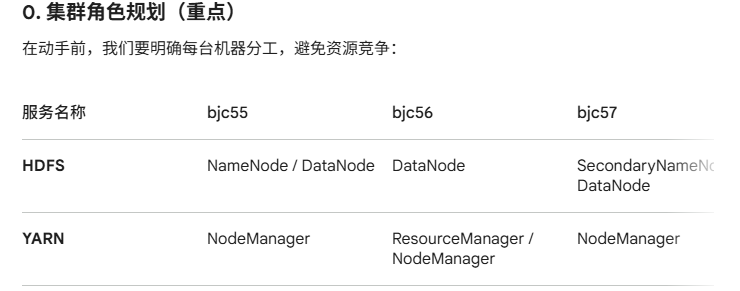

Apache Hadoop 3.3.6 集群部署手册

    部署目标：构建 3 节点分布式集群（HDFS + YARN）
    服务器节点：bjc55, bjc56, bjc57
    软件版本：hadoop-3.3.6.tar.gz

# 一、 环境预检查
1. 基础配置复核
   JDK 1.8+：已经在 /etc/profile 或 ~/.bashrc 中配置好 JAVA_HOME。

    SSH 免密：确保 bjc55 可以免密登录 bjc56 和 bjc57（这是 HDFS 启动脚本的要求）。

    防火墙：确认已关闭（systemctl status firewalld）。

2. 解压与重命名（在 bjc55 操作）

        tar -zxvf /opt/software/hadoop-3.3.6.tar.gz -C /opt/module/
        cd /opt/module/
        mv hadoop-3.3.6 hadoop

3. 创建必要目录
   
        mkdir -p /opt/module/hadoop/data/dfs/name
        mkdir -p /opt/module/hadoop/data/dfs/data

4. 修改配置文件 (位于 etc/hadoop/ 目录下)
   这是最核心的一步，共有 6 个文件需要配置：

#  hadoop-env.sh
         vim /opt/module/hadoop/etc/hadoop/hadoop-env.sh

         export JAVA_HOME=/opt/module/jdk
# core-site.xml
      vim /opt/module/hadoop/etc/hadoop/core-site.xml 

                <configuration>
                <property>
                <name>fs.defaultFS</name>
                <value>hdfs://bjc55:8020</value>
                </property>
                <property>
                <name>hadoop.tmp.dir</name>
                <value>/opt/module/hadoop/data</value>
                </property>
                </configuration>
# hdfs-site.xml
         vim /opt/module/hadoop/etc/hadoop/hdfs-site.xml

                <configuration>
                <property>
                <name>dfs.namenode.name.dir</name>
                <value>file://${hadoop.tmp.dir}/dfs/name</value>
                </property>
                <property>
                <name>dfs.datanode.data.dir</name>
                <value>file://${hadoop.tmp.dir}/dfs/data</value>
                </property>
                <property>
                <name>dfs.namenode.secondary.http-address</name>
                <value>bjc57:9868</value>
                </property>
                </configuration>
#  yarn-site.xml
           vim /opt/module/hadoop/etc/hadoop/yarn-site.xml 

                <configuration>
                <property>
                <name>yarn.resourcemanager.hostname</name>
                <value>bjc56</value>
                </property>
                <property>
                <name>yarn.nodemanager.aux-services</name>
                <value>mapreduce_shuffle</value>
                </property>
                <property>
                <name>yarn.log-aggregation-enable</name>
                <value>true</value>
                </property>
                </configuration>
#  mapred-site.xml

           vim /opt/module/hadoop/etc/hadoop/mapred-site.xml

                <configuration>
                <property>
                <name>mapreduce.framework.name</name>
                <value>yarn</value>
                </property>
               <property>
                   <name>mapreduce.application.classpath</name>
                   <value>/opt/module/hadoop/etc/hadoop:/opt/module/hadoop/share/hadoop/common/lib/*:/opt/module/hadoop/share/hadoop/common/*:/opt/module/hadoop/share/hadoop/hdfs:/opt/module/hadoop/share/hadoop/hdfs/lib/*:/opt/module/hadoop/share/hadoop/hdfs/*:/opt/module/hadoop/share/hadoop/mapreduce/*:/opt/module/hadoop/share/hadoop/yarn:/opt/module/hadoop/share/hadoop/yarn/lib/*:/opt/module/hadoop/share/hadoop/yarn/*
               </value>
               </property>
                </configuration>
#  workers（关键：决定哪些机器是 DataNode）
删除原有的 localhost，修改为：

                bjc55
                bjc56
                bjc57

3. 集群分发
   将配置好的 Hadoop 同步到其他节点：

         scp -r /opt/module/hadoop bjc56:/opt/module/
         scp -r /opt/module/hadoop bjc57:/opt/module/

三、 服务初始化与检查
1. 格式化 NameNode（仅第一次启动前执行！）
   在 bjc55 上执行：

        /opt/module/hadoop/bin/hdfs namenode -format
***老师的红牌警告：格式化成功会看到 Exiting with status 0。绝对不能多次格式化，否则 DataNode 和 NameNode 的 ClusterID 会不一致导致无法连接。***

2. 启动集群
   启动 HDFS（在 bjc55 上执行）：

            /opt/module/hadoop/sbin/start-dfs.sh

启动 YARN（注意：必须在 bjc56 上执行，因为它是 RM）：

      /opt/module/hadoop/sbin/start-yarn.sh

3. 验证检查
   第一步：JPS 进程检查

        bjc55: NameNode, DataNode, NodeManager
        bjc56: ResourceManager, DataNode, NodeManager
        bjc57: SecondaryNameNode, DataNode, NodeManager

第二步：Web 界面访问
在浏览器中打开：

    ***HDFS 启动通常在 NameNode 所在节点，YARN 启动必须在 ResourceManager 所在节点。***

    HDFS 管理页：http://bjc55:9870（检查 Live Nodes 是否为 3）
    YARN 管理页：http://bjc56:8088（检查 Active Nodes 是否为 3）

#第三步：跑一个经典的 WordCount
验证计算集群是否正常：

Bash
# 创建 HDFS 测试目录
    /opt/module/hadoop/bin/hadoop fs -mkdir /input
# 上传一个小文件
    /opt/module/hadoop/bin/hadoop fs -put /etc/hosts /input
# 运行官方 Demohadoop
    /opt/module/hadoop/bin/hadoop jar /opt/module/hadoop/share/hadoop/mapreduce/hadoop-mapreduce-examples-3.3.6.jar wordcount /input /output
# 查看结果
    /opt/module/hadoop/bin/hadoop fs -cat /output/*